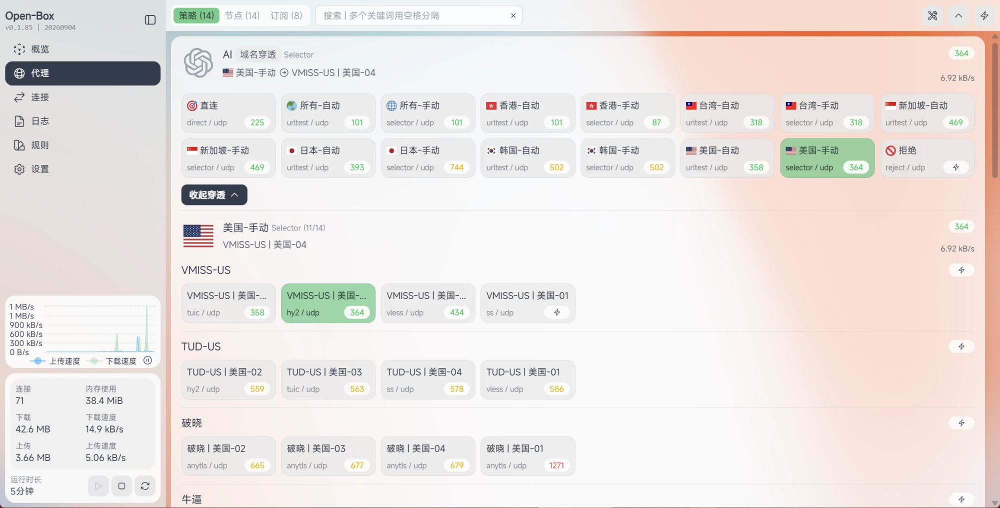
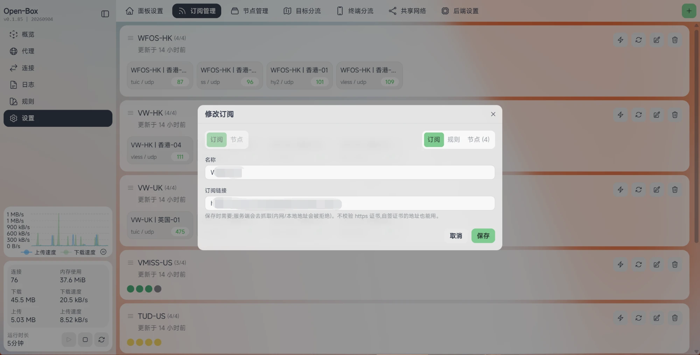

<picture>
  <source media="(prefers-color-scheme: dark)" srcset="docs/pic/logo-dark.png">
  
</picture>

OpenWrt 上的一体化透明代理:一条命令装完 sing-box 内核和管理面板,首次打开面板设个密码、跟引导走,不用手写任何配置文件。

订阅、节点、分流规则、DNS 接管、防火墙改动全部由面板托管,配错了也能一键恢复直连。

## 界面

**代理 · 策略**:每个站点集一张卡片,直接看到它此刻走哪条线路、下面这些节点的健康状况。


**域名穿透**:展开任意一条策略,一层层看到「站点集 → 节点组 → 具体节点」的完整链路,每一层都能当场改。



**规则 · 真实路由**:输入一个域名,先按规则推一遍,再真发一次请求看它实际走了哪条线、DNS 用了哪台服务器、命中第几条规则。


**订阅管理**:Clash 配置和分享链接都能吃,节点按地区自动改名分组。



**出站节点**:自动择优组和手动组混排,动态组按关键词自动收编新节点,不用每次刷新订阅回来重勾一遍。


**目标分流**:一个站点集 = 一组匹配条件 + 一个同名出站,规则集来自 MetaCubeX 的 meta-rules-dat(含被墙域名表)。


**后端设置**:IPv6、测速地址和 Open-Box 统一更新的计划任务都在这里。


## 下载

请从 [GitHub Releases](https://github.com/liandu2024/Open-Box/releases/latest) 下载对应架构的完整安装包：

- `x64`：x86_64 路由器
- `arm64`：aarch64 路由器

完整安装包包含程序、内核和 GeoSite / GeoIP 数据，首次安装无需额外下载规则数据库。每个资产旁边都有 SHA256 校验文件。

## 安装

SSH 以 root 登录 OpenWrt 路由器后执行：

```sh
curl -fsSL https://raw.githubusercontent.com/liandu2024/Open-Box/main/scripts/install.sh | sh
```

GitHub 访问不畅时，可使用安装脚本支持的镜像参数：

```sh
curl -fsSL https://raw.githubusercontent.com/liandu2024/Open-Box/main/scripts/install.sh | sh -s -- --mirror
```

要求：OpenWrt、x86_64 或 aarch64、至少 512MB 存储空间和 512MB 内存。

## 升级

```sh
curl -fsSL https://raw.githubusercontent.com/liandu2024/Open-Box/main/scripts/update.sh | sh
```

升级会校验本地 Open-Box、sing-box 和 GeoSite / GeoIP 组件版本；版本一致且文件完整时直接复用，只有变化或损坏的组件才从本仓库 Release 下载。

## 卸载

默认保留订阅和配置数据：

```sh
curl -fsSL https://raw.githubusercontent.com/liandu2024/Open-Box/main/scripts/uninstall.sh | sh
```

连数据一起删除：

```sh
curl -fsSL https://raw.githubusercontent.com/liandu2024/Open-Box/main/scripts/uninstall.sh | sh -s -- --purge
```

## 许可证

本仓库公开安装、升级和卸载所需脚本及发布资产。面板和内核的许可证与版权信息随安装包提供。
